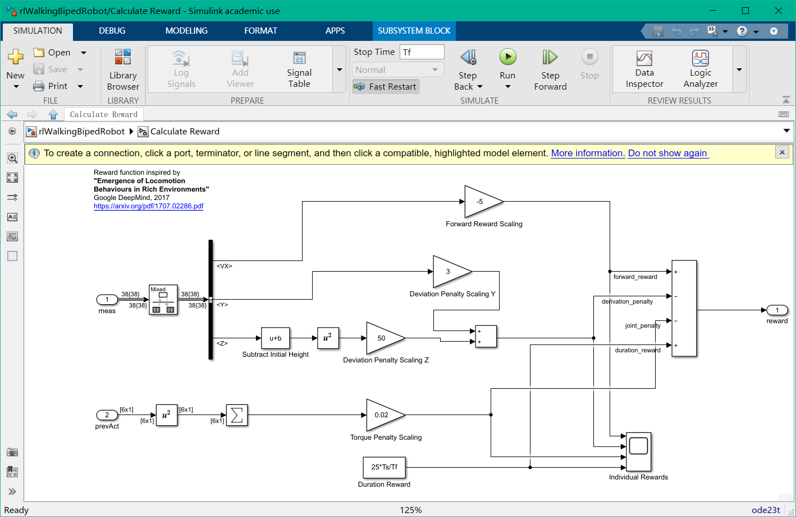
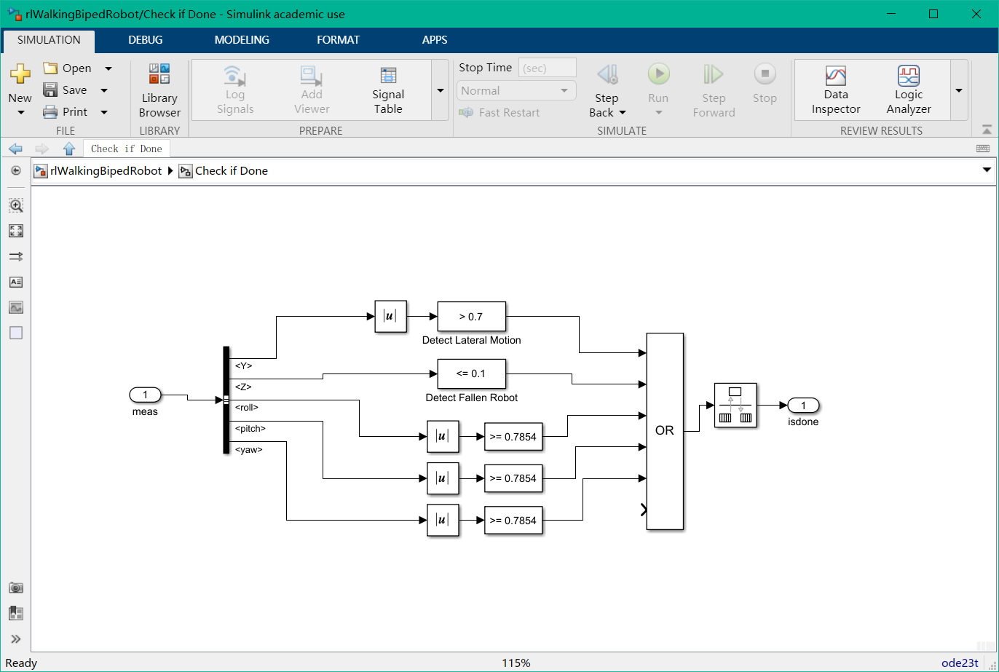
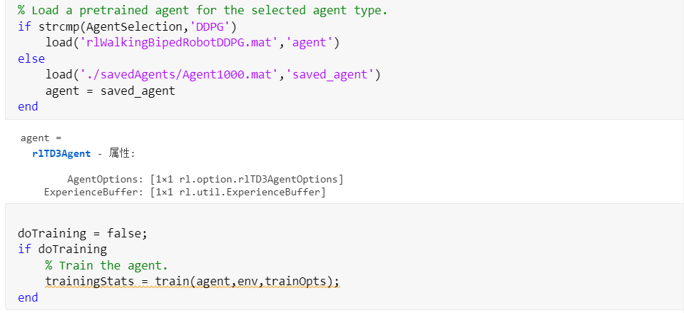

# 无人系统设计 第二次作业

张澳 518021910368

## exe2：目标，训练机器人倒退行走

- 改动1：修改reward函数，原本的函数为$\boldsymbol{r}_{t}=v_{x}-3 y^{2}-50 \hat{z}^{2}+25 \frac{\mathrm{Ts}}{\mathrm{Tf}}-0.02 \sum_{i} u_{t-1}^{i} 2$

	修改为：

	$\boldsymbol{r}_{t}=-5v_{x}-3 y^{2}-50 \hat{z}^{2}+25 \frac{\mathrm{Ts}}{\mathrm{Tf}}-0.02 \sum_{i} u_{t-1}^{i} 2$

	将$v_x$的奖励参数修改为负数，即当机器人严x轴向后退时会获得更大的reward，从而激励机器人向后倒退。

	【实际训练时，刚开始只是将原本的1改为-1，但是在训练过程中，发现机器人会出现倒退一定距离后，就在原地卡死的情况，所以为了机器人走得更快，走得更远，所以将其倒退行走的reward参数修改得更大了一些】

	

- 改动2：修改check if done

	

	在训练过程中，发现机器人走路不是很直，所以将y值允许偏离值改小为[-0.7,0.7]，从而让训练出来的机器人走得更直。

- 改动3：修改训练轮数

	```matlab
	maxEpisodes = 1000;  % 此参数为一次训练的轮数，训练时参数尝试过200,500,1000, 一次训练越多轮，耗时越久，也有可能出现训练次数过多后，matalab由于内存等原因崩溃的情况，所以在我训练中一次中最大训练轮数为1000
	maxSteps = floor(Tf/Ts);
	trainOpts = rlTrainingOptions(...
	    'MaxEpisodes',maxEpisodes,...
	    'MaxStepsPerEpisode',maxSteps,...
	    'ScoreAveragingWindowLength',250,...
	    'Verbose',false,...
	    'Plots','training-progress',...
	    'StopTrainingCriteria','EpisodeCount',...
	    'StopTrainingValue',maxEpisodes,...
	    'SaveAgentCriteria','EpisodeCount',...
	    'SaveAgentValue',maxEpisodes);
	```

	每一次训练结束后，训练完的参数会记录在之中

- 改动4：在已有训练参数基础上继续训练

	

	参数修改包含，加载已有参数模型，以及继续训练

	训练时`doTraining`变量值为true。

## 运行说明

1. 首先是创建环境的界面，以及定义 观测数据[obsInfo],动作数据[actInfo]的数据类型。
2. 选择agent模型，有两种选择——“TD3”和“DDPG”，训练时选用默认用训练模型“TD3"，因为介绍说此模型更加稳定。
3. 接着是定义训练时的参数，包括训练轮数，训练步长等
4. 然后是加载已有训练的模型，若没有已有训练的模型，则跳过这一步
5. 开始训练。

